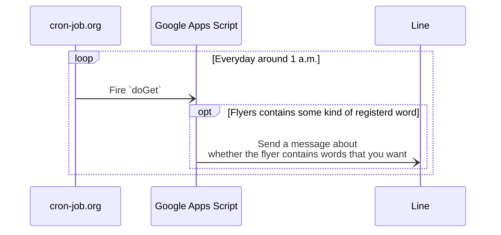

# Tirashi Observer Bot

Tirashi Observer is a bot by GAS: this can observe that you want to search words from given flyers.

## Dependencies

1. [cron-job.org](https://console.cron-job.org/)
2. [Line](https://developers.line.biz/ja/)
3. [Google Apps Script](https://www.google.com/script/start/)



## Usecases

1. You can register a word to want to observe.
2. You can list registered words.
3. You can delete a registered word.

## Directory Structure

This project is using `yarn@berry` as a package manager; also, the workspace feature is being used.

```bash
. # Workspace root package
├── appsscript.json
├── package.json # The config for the workspace root package
├── projects
│   └── tirashi-observer-bot # A workspace
│       ├── package.json # The config for the workspace package
│       ├── .clasp.json # Contains `rootDir` as `../..`
│       ├── .claspignore
│       └── src # Place the main code to do `doGet` etc
│           └── script.ts
├── _properties.ts # To initialize properties
└── README.md
```

## Preparing GAS

1. Install GAS
    ```bash
    npm install --location=global @google/clasp
    ```
2. Setup GAS to be able to use `clasp run`.  
   Please refer to [here](https://github.com/google/clasp/blob/master/docs/run.md#run)
3. Setup a GAS project running `clasp create --rootDir projects/tirashi-observer-bot` or `clasp clone <scriptId> --rootDir projects/tirashi-observer-bot`, and then
    1. Add `projectId` into the `.clasp.json`  
       (In command, run `clasp setting projectId <projectId>` on the `tirashi-observer-bot/`)
    2. Register the number of the same project from the the settings page of the script editor. (You can open the script editor by `clasp open`)  
       
4. Setup the script properties.
    1. `cd projects/tirashi-observer-bot`
    2. ```bash
       clasp run _initScriptProperties \
         --params '{"TIRASHI_URL": "url1,url2,..."}'
       ```
        If you want to search words from multiple flyers, you can specify a value separeting `,`
