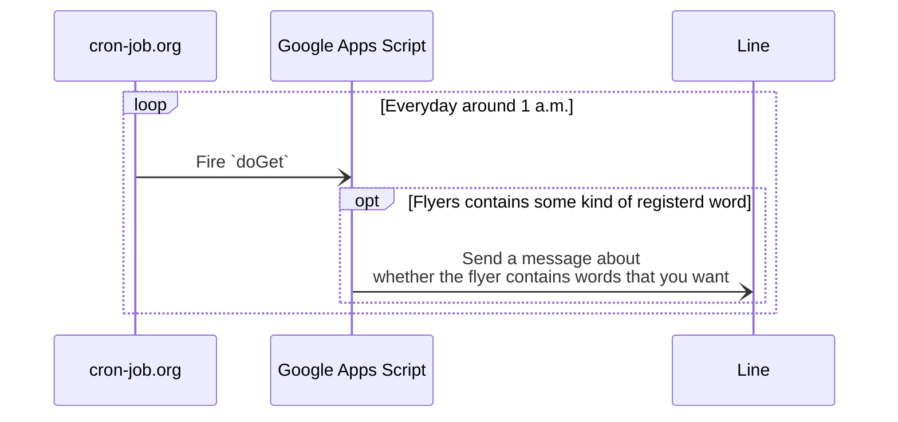
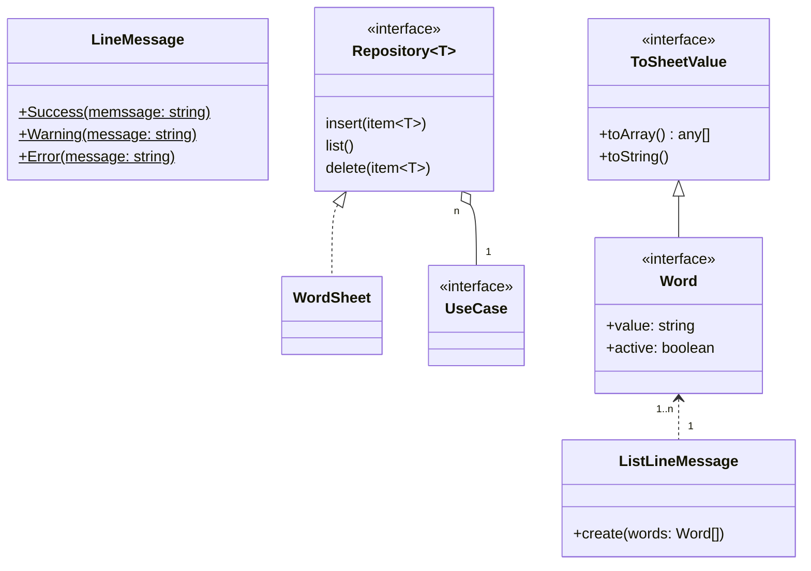

# Tirashi Observer Bot

Tirashi Observer is a bot by GAS: this can observe that you want to search words from given flyers.

## Dependencies

1. [cron-job.org](https://console.cron-job.org/)
2. [Line](https://developers.line.biz/ja/)
3. [Google Apps Script](https://www.google.com/script/start/)



## Usecases

1. You can register a word to want to observe.
2. You can list registered words.
3. You can delete a registered word.

## Directory Structure

This project is using `yarn@berry` as a package manager; also, the workspace feature is being used.

```bash
. # Workspace root package
├── appsscript.json
├── package.json # The config for the workspace root package
├── projects
│   └── tirashi-observer-bot # A workspace
│       ├── package.json # The config for the workspace package
│       ├── .clasp.json # Contains `rootDir` as `../..`
│       ├── .claspignore
│       └── src # Place the main code to do `doGet` etc
│           └── script.ts
├── _properties.ts # To initialize properties
└── README.md
```

This project doesn't actually have such as `.clasp.json`. That's because It doesn't exist that way to hide secret values.

As a solution to this, actually in my local, mounting `/projects/tirashi-observer-bot/` with my cloud storage. Then all of the files below here are synced with one from the cloud storage. (In short, such as `.clasp.json` exists on the cloud storage)

## Preparing Workspace

```bash
yarn
```

## Preparing GAS

1. Install GAS
    ```bash
    npm install --location=global @google/clasp
    ```
2. Setup GAS to be able to use `clasp run`.  
   Please refer to [here](https://github.com/google/clasp/blob/master/docs/run.md#run)
3. Setup a GAS project running `clasp create --rootDir projects/tirashi-observer-bot` or `clasp clone <scriptId> --rootDir projects/tirashi-observer-bot`, and then
    1. Add `projectId` into the `.clasp.json`  
       (In command, run `clasp setting projectId <projectId>` on the `tirashi-observer-bot/`)
    2. Register the number of the same project from the settings page of the script editor. (You can open the script editor by `clasp open`)  
       
4. Setup the script properties.
    1. `cd projects/tirashi-observer-bot`
    2. ```bash
       clasp run _initScriptProperties \
         --params '{"TIRASHI_URL": "url1,url2,..."}'
       ```
        If you want to search words from multiple flyers, you can specify a value separated by `,`.

## Hosting

This project makes very small use of the hosting feature of Firebase. It is for using icons in a Line message.

Its preparation is the following.

```bash
# Install Firebase
npm install --location=global firebase-tools

# Login to Firebase, and set FIREBASE_TOKEN for using firebase-cli features.
firebase login:cli
# ... prints the token
export FIREBASE_TOKEN=<Paste the above token>

# Deploy
firebase deploy
```

`/public/` directory is the root of the hosting.

### Icons

Icons are placed on the `/public/tinified/`; also, all of the icons (png) were minified by https://tinypng.com/.

## Test

This project is depending on [Jest](https://jestjs.io/) testing framework.

### Setup

1. `mv .jest/setup-process-env.js.sample .jest/setup-process-env.js`
2. Open it, then put `LINE_TOKEN`
3. run `yarn build`. If you are a VSCode user, It’s also ok that run VSCode's build task(by `cmd+shift+b`)

Some test cases are having `.skip`. This is preventing sending an actual request to another.

If testing them, remove it first before you run `yarn test`; also, you reattach `.skip` to one when finished before `git push`.

## Classes


