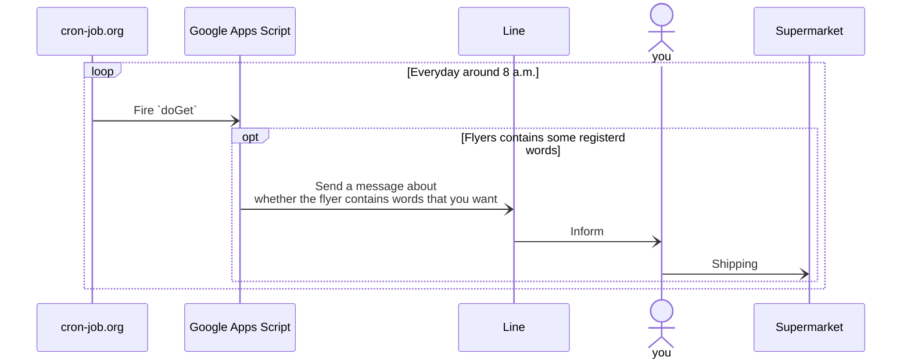

# Tirashi Observer Bot

[](https://github.com/nju33/tirashi-observer-bot/actions/workflows/test.yml)

Tirashi Observer is a bot by GAS: this can observe that you want to search words from given flyers.

## Dependencies

1. [cron-job.org](https://console.cron-job.org/)
2. [Line](https://developers.line.biz/ja/)
3. [Google Apps Script](https://www.google.com/script/start/)



## Usecases

1. You can register a word to want to observe.
2. You can list registered words.
3. You can toggle the state of a registered word.
4. You can delete a registered word.
5. You can receive a message when encountering registered words on tirashis.

## Directory Structure

This project is using `yarn@berry` as a package manager; also, the workspace feature is being used.

```bash
. # Workspace root package
├── appsscript.json
├── package.json # The config for the workspace root package
├── projects
│   └── tirashi-observer-bot # A workspace
│       ├── package.json # The config for the workspace package
│       ├── .clasp.json # Contains `rootDir` as `../..`
│       ├── .claspignore
│       └── src # Place the main code to do `doGet` etc
│           └── script.ts
├── _properties.ts # To initialize properties
└── README.md
```

This project doesn't actually have such as `.clasp.json`. That's because It doesn't exist that way to hide secret values.

As a solution to this, actually in my local, mounting `/projects/tirashi-observer-bot/` with my cloud storage. Then all of the files below here are synced with one from the cloud storage. (In short, such as `.clasp.json` exists on the cloud storage)

## Preparing For Workspace

```bash
yarn
```

## Preparing For GAS

1. Install GAS
    ```bash
    npm install --location=global @google/clasp
    ```
2. Setup GAS to be able to use `clasp run`.  
   Please refer to [here](https://github.com/google/clasp/blob/master/docs/run.md#run)
3. Create a `.clasp.json` on the `projects/tirashi-observer-bot/` directory, and edit it to be like this:
    ```json
    {
        "scriptId": "<your-script-id>",
        "projectId": "<your-project-id-on-gcp>",
        "rootDir": "../..",
        "fileExtension": "ts",
        "filePushOrder": [
            "../../projects/tirashi-observer-bot/src/constants.ts",
            "../../projects/tirashi-observer-bot/src/error.ts",
            "../../_user-function.ts",
            "../../_properties.ts",
            "../../_sheets.ts",
            "../../appsscript.json",
            "../../projects/tirashi-observer-bot/src/event.ts",
            "../../projects/tirashi-observer-bot/src/domains/document.ts",
            "../../projects/tirashi-observer-bot/src/domains/drive.ts",
            "../../projects/tirashi-observer-bot/src/domains/fetch.ts",
            "../../projects/tirashi-observer-bot/src/domains/folder-id-where-flyer-downloads.ts",
            "../../projects/tirashi-observer-bot/src/domains/chat.ts",
            "../../projects/tirashi-observer-bot/src/domains/token.ts",
            "../../projects/tirashi-observer-bot/src/domains/tirashi-url.ts",
            "../../projects/tirashi-observer-bot/src/domains/line.ts",
            "../../projects/tirashi-observer-bot/src/domains/regexp.ts",
            "../../projects/tirashi-observer-bot/src/domains/list-line-message.ts",
            "../../projects/tirashi-observer-bot/src/domains/script-properties.ts",
            "../../projects/tirashi-observer-bot/src/domains/to-sheet-value.ts",
            "../../projects/tirashi-observer-bot/src/domains/words-each-users.ts",
            "../../projects/tirashi-observer-bot/src/domains/user.ts",
            "../../projects/tirashi-observer-bot/src/domains/word.ts",
            "../../projects/tirashi-observer-bot/src/domains/repository.ts",
            "../../projects/tirashi-observer-bot/src/line.ts",
            "../../projects/tirashi-observer-bot/src/services/line-fetch.ts",
            "../../projects/tirashi-observer-bot/src/services/line-message.ts",
            "../../projects/tirashi-observer-bot/src/services/chat-action-reply-message.ts",
            "../../projects/tirashi-observer-bot/src/services/words-matched-message.ts",
            "../../projects/tirashi-observer-bot/src/presentation/line-message.ts",
            "../../projects/tirashi-observer-bot/src/presentation/list-line-message.ts",
            "../../projects/tirashi-observer-bot/src/presentation/chat-action-reply-message.ts",
            "../../projects/tirashi-observer-bot/src/presentation/words-matched-message.ts",
            "../../projects/tirashi-observer-bot/src/infrastructure/document.ts",
            "../../projects/tirashi-observer-bot/src/infrastructure/drive.ts",
            "../../projects/tirashi-observer-bot/src/infrastructure/fetch.ts",
            "../../projects/tirashi-observer-bot/src/infrastructure/line-fetch.ts",
            "../../projects/tirashi-observer-bot/src/infrastructure/script-properties.ts",
            "../../projects/tirashi-observer-bot/src/infrastructure/user-sheet.ts",
            "../../projects/tirashi-observer-bot/src/infrastructure/word-sheet.ts",
            "../../projects/tirashi-observer-bot/src/usecases/chat.ts",
            "../../projects/tirashi-observer-bot/src/usecases/delete-registered-word.ts",
            "../../projects/tirashi-observer-bot/src/usecases/activate-registered-word.ts",
            "../../projects/tirashi-observer-bot/src/usecases/examine-flyers-by-words.ts",
            "../../projects/tirashi-observer-bot/src/usecases/inactivate-registered-word.ts",
            "../../projects/tirashi-observer-bot/src/usecases/list-registered-words.ts",
            "../../projects/tirashi-observer-bot/src/usecases/register-word.ts"
        ]
    }
    ```
4. Also, register the number of the same project from the settings page of the script editor. (You can open the script editor by `clasp open`)  
   
5. Setup the script properties.
    1. Set `TIRASHI_URL` and `LINE_TOKEN`. For that like propose, like the below command is executed.
        ```bash
        yarn tob:$ _initScriptProperties \
          --params '{"TIRASHI_URL": "url1,url2,...", "LINE_TOKEN": "..."}'
          # ^ If you want to search words from multiple flyers,
          #   you can specify a value separated by `,`.
        ```
    2. If you want to change where flyers are downloaded tempolary (for any destructive issues), you can similarly set the `TEMPORARY_DIRECTORY_TO_DOWNLOAD_FLYER`.

### Note about TIRASHI_URL

<!-- It cannot be used as the `TIRASHI_URL` that a URL contains params. For example, as `https://example.com?key=aqwsedrftgyhujikolp`. When using like URL, Line throws an error `invalid uri scheme` at least.
And maybe, There are further conditions to occur errors.

If feeling that the URL you want to use is complex, I recommend using the redirect feature of Firebase’s hosting. The URL is cleaned by using this. -->

When Line gets a flyer image, its content is returned from the cache after the second time; therefore, changing the URL every time is needed.

To take the measure of this, Firebase’s hosting feature is used in the like below:

1. Open `firebase.json`
2. Add `hosting.redirects` in the below.
    ```json
    {
        "hosting": {
            "...": "...",
            "redirects": [
                {
                    "source": "/cleaned-image-url/**",
                    "destination": "https://example.com?key=aqwsedrftgyhujikolp",
                    "type": 301
                }
            ]
        }
    }
    ```
3. `firebase deploy`
4. Done. Now, you can access to `https://example.com?key=aqwsedrftgyhujikolp` via `<your-hosting-url>/cleaned-image-url/123456789`

#### Note

You don't include the last directory (`123456789` as mentioned above) in the TIRASHI_URL.

-   👍 `<your-hosting-url>/cleaned-image-url`
-   👎 `<your-hosting-url>/cleaned-image-url/123456789`

## Code notes

### About Export and Import

This project has a lot of code like the one below.

```ts
const A: typeof _A = typeof _A === 'undefined' ? exports.A : _A
// As a side note, the above is registered as a snippet to use typing `constimported` in a `.ts` file.
```

Mainly, that reason is for coexistence in standard code on GAS and tests.

First about `typeof _A === 'undefined'`. This comfirms to `_A` is defined. That's because pushed codes by clasp are to comment out all of `import` lines. In short, the `_A` imported is always undefined on GAS, and GAS throws an error when we immediately try to access it. So, comfirming defined it before accesing.

On the other hand, all of `import` lines are fine when running tests (by jest). In short, the `_A` imported is properly defined and able to use it.

Next about `exports.A`. All of `export <name> ...` lines of uploaded codes, which is writing by Typescript, by clasp transpile into `exports.<name> = …` or `<name> …`. In each files, redefining of the `<name>` is needed; so, this project is using `exports.<name> = …`.

If GAS throws an error around here, the matter is a typo of the code or incorrect orders of pushing files. In the letter case, we could fix this to set correct orders to the ["filePushOrder" of the clasp config](https://github.com/google/clasp#project-settings-file-claspjson).

## Hosting

This project makes very small use of the hosting feature of Firebase. It is for using icons in a Line message.

Its preparation is the following.

```bash
# Install Firebase
npm install --location=global firebase-tools

# Login to Firebase, and set FIREBASE_TOKEN for using firebase-cli features.
firebase login:cli
# ... prints the token
export FIREBASE_TOKEN=<Paste the above token>

# Deploy
firebase deploy
```

`/public/` directory is the root of the hosting.

### Icons

Icons are placed on the `/public/tinified/`; also, all of the icons (png) were minified by https://tinypng.com/.

## Run Scripts

### tob:

Run a script that is defined on the `tirashi-observer-bot` workspace.

#### push

Push local codes to the remote project.

#### deployments

Can list deployments of the remote project.

#### deploy

Create a new deployment by the state at the time.

#### update

Update the newest deployment by the state at the time.

### tob:$

Run codes on the remote project from local.

## Test

This project depends on [Jest](https://jestjs.io/)](https://jestjs.io/) testing framework.

### Setup

1. `mv .jest/setup-process-env.js.sample .jest/setup-process-env.js`
2. Open it, then put `LINE_TOKEN`
3. Run `yarn build`. If you are a VSCode user, It’s also ok that run VSCode's build task(by `cmd+shift+b`)

Some test cases have `.skip`. This prevents sending an actual request to another.

If testing them, remove it first before you run `yarn test`; also, you reattach `.skip` to one when finished before `git push`.
